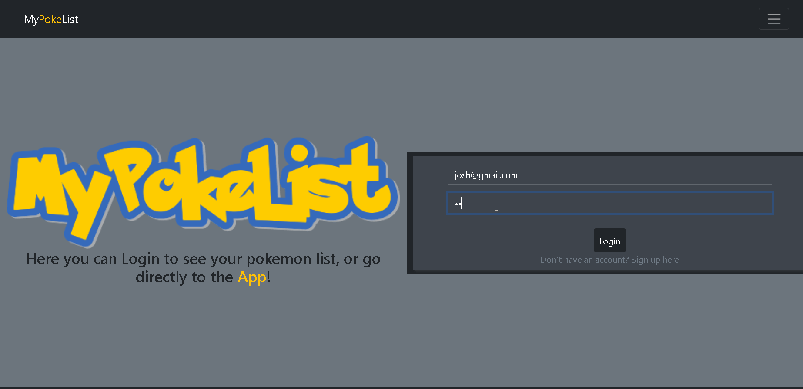

# **MyPokeList**

This project was developed for the summer Web Development course at JEDI Academy in 2020-21 Q2.

## **Motivation**

The project was developed with the aim of learning web development using HTML, CSS and vanilla Javascript, using some external libraries to ease some aspects of the development.

## **About the Project**

The project consists in a simple responsive website with login capabilities and API interaction with `PokéAPI`.

### **Implemented functionality**

* Simple user Login/Logout (`Warning: "simple string comparison"`).
* User registration.
* Search Pokemon in `PokéAPI` by ID or Name.
* Search previous/next Pokémon.
* Show some Pokémon attributes.
* Add Pokémon to user's favorites list.
* Show/Hide user favorite Pokémon list.

## **Technologies Used**

* [Axios v0.25.0](https://axios-http.com) for promise handling.
* [Bootstrap v5.0.2](https://getbootstrap.com) for page main layout and responsiveness.
* [JQuery v3.6.0](https://jquery.com) for DOM interaction and animating some components.
* [PokéAPI](https://pokeapi.co) as the main API for retrieving content.
* [Netlify](https://www.netlify.com) for deploying the app.

## **Try it!**

[App website](https://pedantic-bardeen-f03be4.netlify.app)
